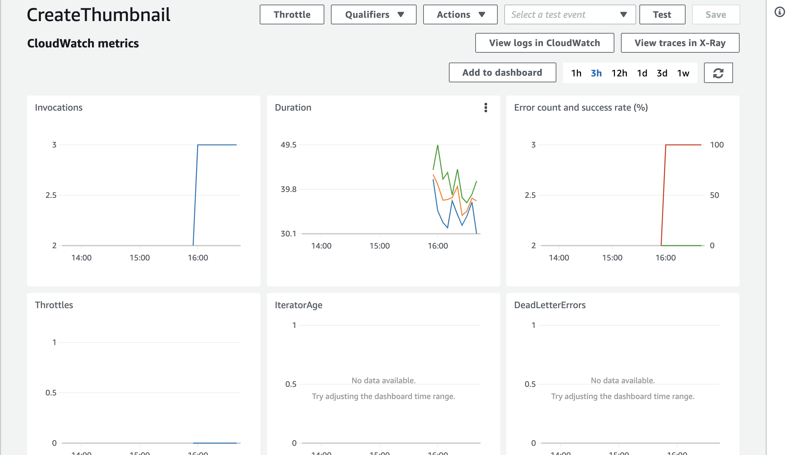

# Taskmaster
This app is gerared toward task-tracking to allow users to keep track of tasks to be done and their status.

## Site URL

http://cdmarch-taskmaster-dev.us-west-2.elasticbeanstalk.com/

## Issues

Java Depenedency versions

## How to run locally

From terminal run `git clone https://github.com/dmarchante/taskmaster.git`

Set Access Key Id and Secret Access Key to connect to DynamoDB

Hit play from IntelliJ

## Changelog

- updated task model to accept assignee
- add routes to allow for setting assignees, and for retrieveing task for specific assignee's
- added logic to set status to assigned when assignee is added

## Screenshots for Monitoring
[]
[Cloudwatch Rules](./docs/assets/cloudwatch-rules.png)
[ECS Cronjob Metrics](./docs/assets/ecs-metrics.jpg)
